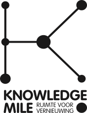

<p align="center"></p>  
<br>

<h1 align="center" style="border: none !important; padding-bottom: 1em !important;">🗺️ Knowledgemile Maps 🗺️</h1>  


<p align="center">
<br>Supporting knowledgemile Park project with an interactive map of the 'urban climate' and the 'biodiversity' of its surroundings from open data sources.  
Made with Rstudio and build on <a href="https://rstudio.github.io/shinydashboard/">Shiny Dashboards</a> and <a href="https://rstudio.github.io/leaflet/">Leaflet for R</a>.<br>  
The research question of this project was: "How can biodiversity and urban climate of the knowledge mile park be mapped that creates added value for discussions and meetings with stakeholders?"  <br>
 
<br>
</p>

---
## 🔎 Table of content
The index of this document. In this document you can find references to used sources. There is also a short description about how this project can be replicated.
  * [Features](#features)
    + [Maps](#maps)
    + [Map features](#map-features)
    + [Theme](#theme)
  * [Development Knowledgemile Maps](#development-knowledgemile-maps)
    + [Requirements for deployment](#requirements-for-deployment)
    + [Packages used](#packages-used)
    + [Coordinate Reference Systems](#coordinate-reference-systems)
    + [File structure](#file-structure)
  * [Contact](#contact)
  

## <a name="features"></a> 🔦 Features
The following features are implemented
### Maps
- Hittestress:  
  - [link to source](http://nationaalgeoregister.nl/geonetwork/srv/dut/catalog.search#/metadata/a87f5ca8-f354-4ff6-adc3-70f1bf6b78e3)  
  - [Download](http://geodata.rivm.nl/downloads/ank/RIVM_R88_20170621_gm_actueelUHI.zip)   
  - [link to origin](https://www.atlasnatuurlijkkapitaal.nl/kaarten)   
- Tree's datasets:  
  - [link to source part 1](https://maps.amsterdam.nl/open_geodata/?k=254)    
  - [link to source part 2](https://maps.amsterdam.nl/open_geodata/?k=255)    
  - [link to source part 3](https://maps.amsterdam.nl/open_geodata/?k=256)      
  - [link to source part 4](https://maps.amsterdam.nl/open_geodata/?k=257)    
- Groene daken  
  - [link to source](https://maps.amsterdam.nl/open_geodata/?k=51)
- Play Grounds  
  - [link to source]()

### Map features
- minimap | [guide](https://rstudio.github.io/leaflet/morefeatures.html) | [link to source](https://github.com/Norkart/Leaflet-MiniMap) |
- bigzoom | [guide](https://rstudio.github.io/leaflet/morefeatures.html) | [link to source](https://github.com/CliffCloud/Leaflet.EasyButton) |
- measure  | [guide](https://rstudio.github.io/leaflet/morefeatures.html) | [link to source](https://github.com/ljagis/leaflet-measure) |

### Theme
We used a combination of a bootstrap theme and some custom css ([usage of css in shiny](https://shiny.rstudio.com/articles/css.html)). Bootstrap theme is called "superhero" ([source](https://bootswatch.com/superhero/)).
Usage:
```r
## ui.R ##
library(shinythemes)

shinyUI(bootstrapPage(
            theme = shinytheme("superhero"),
            includeCSS("style.css"),
            ...
        )
)
```
Or a theme selector:
```r
shinythemes::themeSelector()  # <--- Add this somewhere in the UI
```
> [*Read more about themes*](https://rstudio.github.io/shinythemes/)

## <a name="development-knowledgemile-maps"></a> 🛠 Development Knowledgemile Maps
How to continue with the Knowledgemile Maps  

### Requirements for deployment
To make the dashboard publicly available, you can make install shiny server yourself:

- Shiny Server  
 [Official instructions](https://github.com/rstudio/shiny-server/blob/master/README.md#Installing)  
 [Better instructions](https://www.digitalocean.com/community/tutorials/how-to-set-up-shiny-server-on-ubuntu-16-04)   

*OR* use a service:
- [shinyapps.io](https://shinyapps.io)
- [Rstudio Connect](https://www.rstudio.com/products/connect/) (More advanced)

> [*Read more information of deploying shiny dashboard*](https://shiny.rstudio.com/tutorial/written-tutorial/lesson7/)

### Packages used
The following packages are used.  
*copy & paste this code below into a R console to install them* 
```r
install.packages("shiny")
install.packages("markdown")
install.packages("shinyWidgets")
install.packages("shinyhelper")
install.packages("htmlwidgets")
install.packages("rgdal")
install.packages("sf")
install.packages("sp")
install.packages("maps")
install.packages("maptools")
install.packages("leaflet")
install.packages("leaflet.extras")
install.packages("raster")
install.packages("tidyverse")
install.packages("shinythemes")
install.packages("devtools")
install.packages("mapview")
install.packages("RColorBrewer")
install.packages("htmlwidgets")
```

### Coordinate Reference Systems
We use the following CRS throughout the project:  
*+proj=longlat +datum=WGS84 +no_defs +ellps=WGS84 +towgs84=0,0,0*
```r
crs <- "+proj=longlat +datum=WGS84 +no_defs +ellps=WGS84 +towgs84=0,0,0"
```

### File structure
```bash
.
├── style.css                              # css stylesheet
├── server.R                               # server side R script
├── ui.R                                   # Ui side R script    
├── data
│   ├── groene_daken_2.shp
│   ├── raster_amsterdam_hittestress.tif
│   ├── GEBIED_BUURTEN.json
│   ├── ...groen_daken_2.*                 # All other shp file extensions
│   ├── knowledge_mile_bomen_1.shp     
│   ├── ...knowledge_mile_bomen_1.*        # All other shp file extensions 
│   ├── knowledge_mile_bomen_2.shp     
│   ├── ...knowledge_mile_bomen_2.*        # All other shp file extensions 
│   ├── knowledge_mile_bomen_3.shp     
│   ├── ...knowledge_mile_bomen_3.*        # All other shp file extensions 
│   ├── knowledge_mile_bomen_4.shp     
│   └── ...knowledge_mile_bomen_4.*        # All other shp file extensions
├── img      
│   ├── logo.png                           # Knowledgemile logo used in this document
│   └── HVA-logo_ZW.png                    # Hva logo used in this document
└── README.md                              # This document
```


## <a name="contact"></a> 🏷 Contact
```r
# _  __                    _          _              __  __ _ _      
#| |/ /                   | |        | |            |  \/  (_) |     
#| ' / _ __   _____      _| | ___  __| | __ _  ___  | \  / |_| | ___ 
#|  < | '_ \ / _ \ \ /\ / / |/ _ \/ _` |/ _` |/ _ \ | |\/| | | |/ _ \
#| . \| | | | (_) \ V  V /| |  __/ (_| | (_| |  __/ | |  | | | |  __/
#|_|\_\_| |_|\___/ \_/\_/ |_|\___|\__,_|\__, |\___| |_|  |_|_|_|\___|
#   | _  _ |_  |_) _  _ _|_ o  _  _ __   __/ |
# \_|(_)_> | | |_)(_|_>  |_ | (_|(_|| | |___/                                                 
#                                         
# ----
# Minor:            Data Science
# Track:            Urban Analytics
# Semester:         2
# Projectsite:      https://knowledgemile.amsterdam/
# Auteurs:          Josh Bleijenberg;
#                   Bastiaan Groen;
# contactpersonen:  Maarten Terpstra;
#                   Corine Laan;
# ----
```

  
